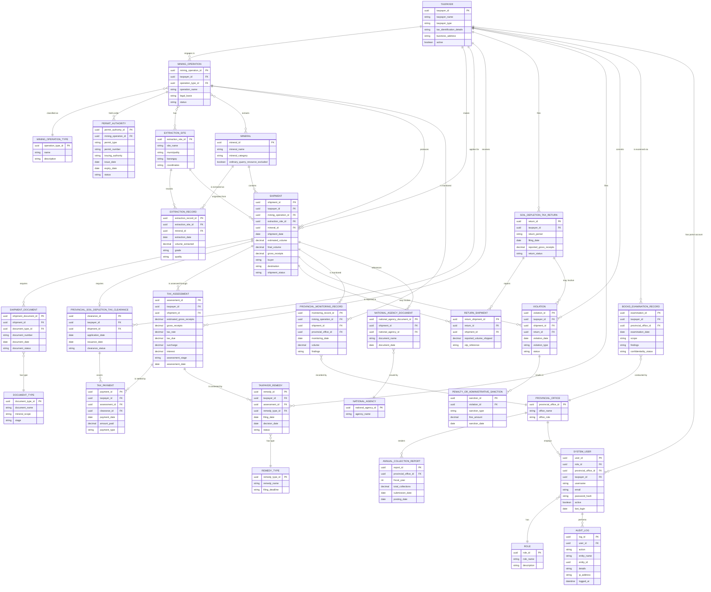

# Camarines Norte Soil Depletion Tax Ordinance of 2026
## Full Entity-Relationship Documentation

> **Basis:** Provincial Ordinance No. ___, Series of 2026, "Camarines Norte Soil Depletion Tax Ordinance of 2026" (Author: Hon. John Carlo "Lukad" V. De Lima).
>
> This document derives every entity, attribute, and relationship directly from Sections 1–21 of the Ordinance. Where the ordinance describes a process, deadline, document, or responsible office, that detail is preserved in the schema rather than flattened into a generic status field.

---

## 1. Diagram

---

## 2. Coverage and exemptions (Sec. 4–5)

**Covered persons:** natural or juridical persons, partnerships, corporations, cooperatives, associations, and small-scale miners or mining associations engaged in commercial extraction, harvesting, processing, or transport of minerals in Camarines Norte, operating under:

- MPSA, FTAA, Exploration Permit with test-shipment authority, Mineral Processing Permit, or other RA 7942 authority — modeled as `MINING_OPERATION_TYPE` = large-scale, with `PERMIT_AUTHORITY` records of the relevant type.
- SSMC, Small-Scale Processing License, or other RA 7076 / PD 1899 / PMRB authority — modeled as `MINING_OPERATION_TYPE` = small-scale.

**Exemptions** (not modeled as taxpayers/shipments at all):
- Ordinary quarry operations under Sec. 138 of the LGC (stone, sand, gravel, earth) — *except* non-metallic minerals such as silica, clay, and marble shipped out, which remain covered. This exception is why `MINERAL.mineral_category` and `MINERAL.ordinary_quarry_resource_excluded` exist as separate fields rather than a single quarry/non-quarry flag.
- Mineral ore extracted by the National Government or its subdivisions, unless beneficial use has been granted to a taxable person — this would be represented by `TAXPAYER.taxpayer_type = "Government (beneficial use granted)"` rather than a blanket exclusion.

---

## 3. Tax computation (Sec. 6–7)

- **Tax base:** Gross Receipts — the total contract price or value received/accrued from sale, barter, exchange, or disposition of minerals extracted and shipped out, **without deduction** for extraction, processing, transport, or marketing costs.
- **Rate:** 1% of Gross Receipts, flat — no escalation table, no separate valuation schedule. `TAX_ASSESSMENT.tax_rate` exists as a field mainly for auditability/versioning, not because the ordinance allows the rate to vary.
- **Verification source:** Gross receipts for iron ore, gold, and other minerals are determined using official MGB and BSP documents (see Sec. 8 document lists below) — this is why `SHIPMENT_DOCUMENT` and `NATIONAL_AGENCY_DOCUMENT` exist as the evidentiary backing for the `gross_receipts` figure stored on `SHIPMENT` and `TAX_ASSESSMENT`.
- **Small-scale mining:** the tax is assessed/collected by the Provincial Treasurer *in addition to* — not instead of — the Ore Transport Permit issued by the PMRB/Governor's Office. Both are represented: `PERMIT_AUTHORITY` (the OTP/PMRB authority) is distinct from `TAX_ASSESSMENT` (the Treasurer's tax).

---

## 4. Time and manner of payment (Sec. 8)

### 4.1 Accrual
Tax accrues **at the time of shipment**. The Treasurer collects it upon the taxpayer's application for the `PROVINCIAL_SOIL_DEPLETION_TAX_CLEARANCE`.

### 4.2 Provisional payment (Sec. 8b)
- Amount: 50% of the 1% tax on **estimated** gross receipts.
- Required documents by mineral type (each becomes a `SHIPMENT_DOCUMENT` or `NATIONAL_AGENCY_DOCUMENT` row with `DOCUMENT_TYPE.stage = "provisional"`):

| Mineral type | Required documents |
|---|---|
| Iron ore / bulk metallic | OTP application/issuance (MGB Form 12-1); MGB Stockpile Validation or Field Verification Report; Preliminary Draft Survey Report; Sales/Marketing Contract or Pro-forma Invoice |
| Gold bullion / doré / ore-concentrate | OTP (MGB Form 12-1) explicitly covering gold; MGB Bullion Shipment Inspection, Weighing & Sealing Report; Preliminary Assay Report or buyer/refinery valuation |
| Other minerals | OTP; Sales/Marketing Contract or Pro-forma Invoice; Preliminary Assay Report or valuation |

### 4.3 Reconciliation and final payment (Sec. 8c)
- Final transaction documents submitted within **15 days** from their issuance.
- Balance paid within **30 days** from the date of provisional payment or reassessment, whichever comes first.
- Excess payment: credited to succeeding liabilities or refunded per Sec. 196 LGC — this is the `TAXPAYER_REMEDY` with `REMEDY_TYPE = "Refund"` or `"Credit"`.
- Final documents by mineral type (`DOCUMENT_TYPE.stage = "final"`):

| Mineral type | Required documents |
|---|---|
| Iron ore / bulk metallic | Final Commercial Sales Invoice and Bill of Lading; Final Draft Survey Report at port of discharge; BOC Export Declaration and MGB MOEP (if exported) |
| Gold bullion / doré / ore-concentrate | BSP Gold Buying Station Delivery Receipt (or refinery receipt); BSP Final Assay Advice or certified refinery assay; BSP Payment/Transaction Advice |
| Other minerals | OTP; Sales Contract or Invoice; Final Assay Report or valuation |

### 4.4 Quarterly return (Sec. 8d)
Filed within **20 days** after each calendar quarter, stating at minimum: extraction site(s), volumes extracted, volumes shipped (with OTP references), buyer(s)/invoice values/gross receipts, and shipment/transport details. Must be accompanied by MGB Form 29-1 (gold) or 29-6 (iron). This is `SOIL_DEPLETION_TAX_RETURN`, with individual shipments itemized via `RETURN_SHIPMENT`.

### 4.5 Collection mechanisms (Sec. 8e)
Treasurer may adopt supplemental mechanisms for irregular, ambulant, or seasonal shippers — an operational/procedural allowance, not a distinct data entity.

---

## 5. Clearance and national coordination (Sec. 9)

- No mineral may be shipped without a `PROVINCIAL_SOIL_DEPLETION_TAX_CLEARANCE`, issued by the Treasurer for the Governor.
- Issued within **3 working days** from complete submission and payment — track via `application_date` and `issuance_date`.
- The Governor formally requests DENR-MGB to require presentation of the clearance in OTP applications — a coordination duty, not a data-owning relationship (the Ordinance is explicit that this does **not** transfer regulatory authority).
- Non-impairment clause: the clearance is a provincial revenue compliance document only; it does not amend/supersede any national law, rule, permit, or transport authorization.

---

## 6. Monitoring duties (Sec. 10)

| Office | Duty |
|---|---|
| PENRO (with PMRB coordination where appropriate) | Furnish the Treasurer the Draft Survey Report before shipment; maintain updated records of volume, grade, quality, kind, and location of **all** extracted minerals (not just shipped ones) |
| Provincial Treasurer + PENRO | Jointly monitor all extraction and shipment for compliance |
| Municipal/barangay officials | Monitor and report unpaid extraction/shipment to the Province |
| PNP | May assist enforcement |

Modeled as `PROVINCIAL_MONITORING_RECORD`, linked to `MINING_OPERATION`, `SHIPMENT`, and the responsible `PROVINCIAL_OFFICE`. `EXTRACTION_RECORD` is kept separate from `SHIPMENT` precisely because PENRO's monitoring duty covers *all* extraction, whether or not it is ever shipped.

---

## 7. Examination of books (Sec. 11)

Treasurer or deputies may examine taxpayer books/records to ascertain, assess, and collect the correct tax, subject to Sec. 171 LGC limits. Information obtained is confidential and used solely for tax administration. Modeled as `BOOKS_EXAMINATION_RECORD` — a standalone auditable event, not a flag on `TAX_ASSESSMENT`, since an examination can happen independently of any single assessment and carries its own confidentiality obligation.

---

## 8. Fund accrual and reporting (Sec. 12)

- All proceeds (tax, surcharges, interest) accrue to the Province's General Fund per Secs. 130(d) and 305 LGC.
- Budget priority: soil regeneration, agricultural re-cultivation, reforestation/revegetation, watershed protection, acid-mine drainage/siltation mitigation, and ecological restoration.
- Treasurer renders an **annual report** to the Sanggunian, posted per full-disclosure policy — modeled as `ANNUAL_COLLECTION_REPORT`.

---

## 9. Taxpayer's remedies (Sec. 13)

| Remedy | Deadline |
|---|---|
| Protest of assessment | File within 60 days of receipt of assessment notice |
| Treasurer's decision on protest | Within 60 days of filing |
| Appeal to court | Within 30 days of denial, or lapse of the 60-day decision period |
| Refund or credit claim | Within 2 years from payment or entitlement (Sec. 196 LGC) |

Modeled as `TAXPAYER_REMEDY` (shared lifecycle: filing date, decision date, status) typed via `REMEDY_TYPE` (Protest / Refund / Credit), since all three follow the same filing → decision → status pattern despite different deadlines.

---

## 10. Surcharges and interest (Sec. 14)

- Surcharge: **25%** of the tax due (Sec. 168 LGC).
- Interest: **2% per month** on the unpaid amount, *including surcharges*, from due date until paid.
- Cap: total interest may not exceed **36 months**.

Both fields live on `TAX_ASSESSMENT` since they are computed against a specific assessment's unpaid balance.

---

## 11. Penalties and administrative sanctions (Sec. 15)

| Sanction type | Detail |
|---|---|
| Fine | ₱1,000–₱5,000 per violation (Sec. 516 LGC ceiling). Each shipment made **and** each return filed in violation is a separate offense. If committed by a juridical entity, the President/GM/administering officer is personally liable. |
| Suspension/revocation | After notice and hearing, the Governor may suspend/revoke the clearance or any provincially issued permit/license/accreditation. Treasurer withholds new clearances until tax, surcharge, interest, and fines are fully settled. |
| Referral | Formal referral to DENR-MGB, PMRB, and the municipal mayor — explicitly **not** an authorization for the Province to suspend/revoke any national permit. |
| Civil remedies | Distraint of personal property, levy on real property, and judicial action under Secs. 173–185 LGC. |
| Non-excusal | Paying a fine or sanction does not relieve the offender of the underlying tax, surcharge, and interest. |

Modeled as `VIOLATION` (linked to taxpayer, shipment, and/or return — since violations can attach to either) with one-to-many `PENALTY_OR_ADMINISTRATIVE_SANCTION` rows, since a single violation can trigger a fine *and* a suspension *and* a referral simultaneously.

---

## 12. Administrative provisions (Sec. 16–21)

- **IRR (Sec. 16):** Governor issues implementing rules within 60 days of effectivity, on recommendation of the Treasurer, Provincial Legal Office, and PENRO. Not modeled as a data entity — this is a one-time rule-making event outside the transactional schema.
- **Furnishing of copies (Sec. 17):** Certified copies sent to municipal treasurers, DENR-MGB, and the Bureau of Local Government Finance within 10 days — administrative distribution, not a data entity.
- **Publication/posting (Sec. 18):** Three consecutive days in a local newspaper, or posting in two conspicuous places if none exists.
- **Separability (Sec. 19), Repealing clause (Sec. 20), Effectivity (Sec. 21):** standard legislative boilerplate; not modeled.

---

## 13. Relationship summary

| Parent | Cardinality | Child |
|---|---|---|
| TAXPAYER | 1:M | MINING_OPERATION |
| MINING_OPERATION | 1:M | PERMIT_AUTHORITY |
| MINING_OPERATION | M:M | EXTRACTION_SITE |
| MINING_OPERATION | M:M | MINERAL |
| EXTRACTION_SITE | 1:M | EXTRACTION_RECORD |
| MINERAL | 1:M | EXTRACTION_RECORD |
| TAXPAYER | 1:M | SHIPMENT |
| SHIPMENT | 1:M | SHIPMENT_DOCUMENT |
| SHIPMENT | 1:0..1 | PROVINCIAL_SOIL_DEPLETION_TAX_CLEARANCE |
| SHIPMENT | 1:M | TAX_ASSESSMENT |
| TAX_ASSESSMENT | 1:M | TAX_PAYMENT |
| TAXPAYER | 1:M | SOIL_DEPLETION_TAX_RETURN |
| SOIL_DEPLETION_TAX_RETURN | 1:M | RETURN_SHIPMENT |
| TAXPAYER | 1:M | TAXPAYER_REMEDY |
| TAXPAYER | 1:M | VIOLATION |
| VIOLATION | 1:M | PENALTY_OR_ADMINISTRATIVE_SANCTION |
| MINING_OPERATION | 1:M | PROVINCIAL_MONITORING_RECORD |
| TAXPAYER | 1:M | BOOKS_EXAMINATION_RECORD |
| PROVINCIAL_OFFICE | 1:M | ANNUAL_COLLECTION_REPORT |
| PROVINCIAL_OFFICE | 1:M | SYSTEM_USER |
| TAXPAYER | 1:M | SYSTEM_USER |
| ROLE | 1:M | SYSTEM_USER |
| SYSTEM_USER | 1:M | AUDIT_LOG |

---

## 14. Authentication and audit logging (system-level, not ordinance-specified)

The Ordinance describes *who* must do what (Treasurer, PENRO, PMRB, Governor, taxpayer) but does not prescribe a login/access-control model — that's an implementation concern noted in the original scope note. These three entities cover it without over-modeling:

- **`ROLE`** — a lookup table for account types (e.g. Treasurer Staff, PENRO Staff, PMRB Staff, Legal Office, Taxpayer, Admin). Keeps permission logic data-driven rather than hardcoded per office.
- **`SYSTEM_USER`** — one account table for both internal staff (`provincial_office_id` set) and taxpayer portal users (`taxpayer_id` set) who file returns, apply for clearances, or file remedies online. A user should have exactly one of the two FKs populated, not both.
- **`AUDIT_LOG`** — a single generic log table (`entity_name` + `entity_id` pattern) covering actions across every table in the schema, rather than a separate log per entity. This is deliberately simple: it records *who did what to which record and when*, which is enough to satisfy Sec. 11's confidentiality requirement on examined records and to support later dispute resolution (e.g., "who issued this clearance," "who approved this refund") without adding per-entity audit tables.

## 15. Scope note

This is a **conceptual ERD**, not a finalized physical database schema. The Ordinance establishes business rules, deadlines, and required documents, but does not specify implementation details such as database engine, UUID vs. integer keys, exact normalization, user/authentication tables, file storage, e-signature handling, or chart-of-accounts integration. Those should be designed separately, informed by this ordinance-derived business model.